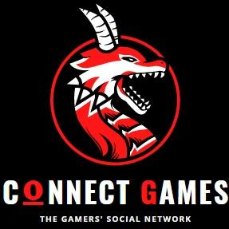

# **CONNECT GAMES**

(Project Module 3 Ironhack)

 

 Demo [HERE]('') **IROBEERS**

### Introduction

* Project module 3, Web Development course Ironhack wdpt may 2021.

* The social network dedicated to those who are crazy about games.
Here you can have your most played games as favorites and follow your colleagues.
### 📋 Requirements to play

* Internet

## 📦 Development

JavaScript | Axios | React | NodeJs | Express | MongoDB

### 🎁 Expressions of gratitude

* I would like to thank the **Ironhack** school for the experience and learning that is provided to us.
The teachers **Daniel K Albanez (DK)**, **Gabriel Sicuto** and **Júlia Foresti**, for the way that the content is presented in the classroom and the support of doubts inside and outside the classroom.
Thank you very much for this first module 🤓.

---
**Developer:** ⌨️ with ❤️ by [Jhonatan Veras](https://github.com/jhonatanveras) 😊
**Developer:** ⌨️ with ❤️ by [Renan Oliveira](https://github.com/RenanOliveira20) 😊
**Developer:** ⌨️ with ❤️ by [Luana Nadai](https://github.com/lua-nadai) 😊
